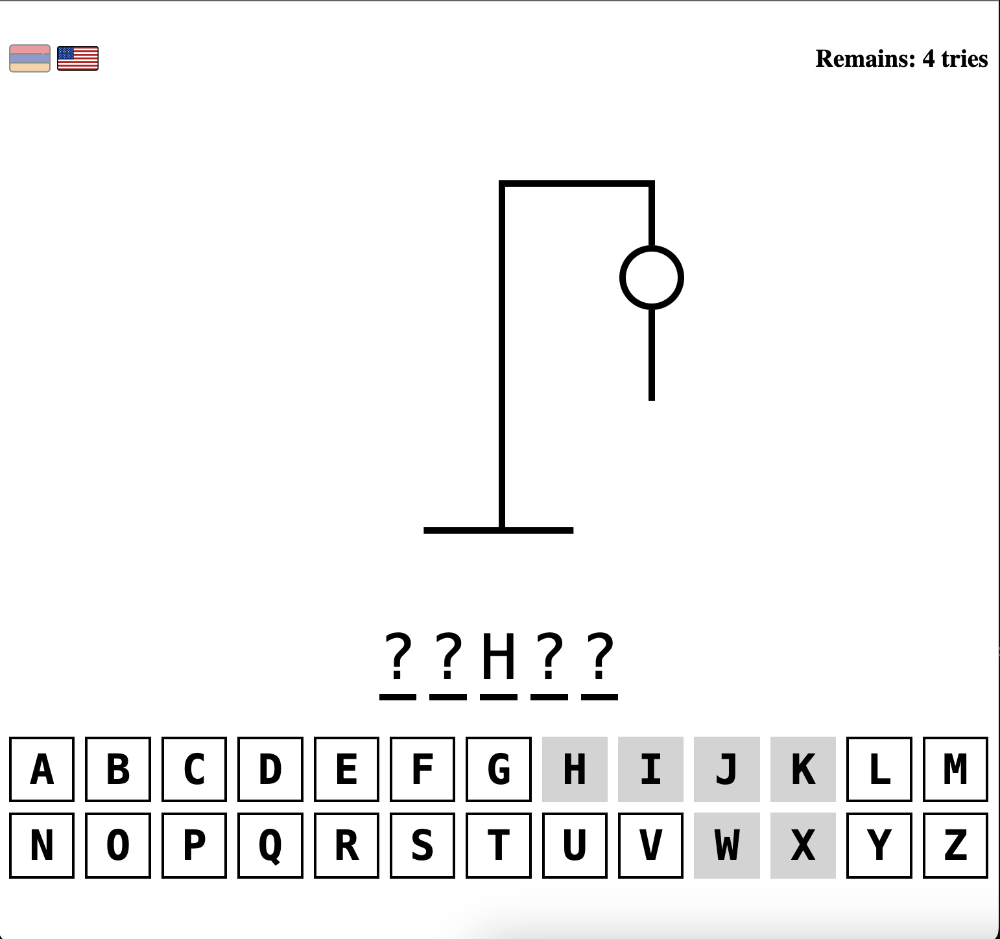
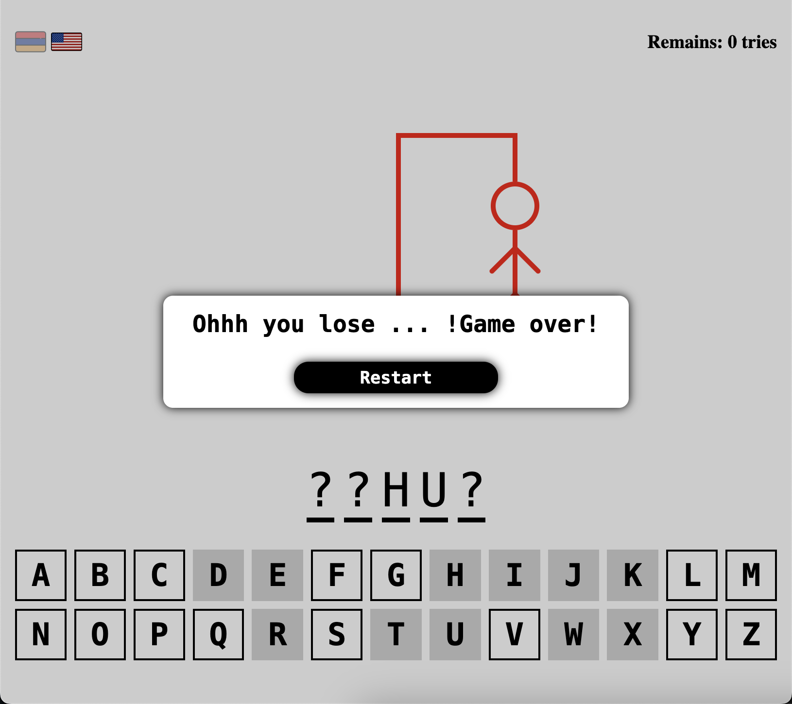

# Hangman Game

Hangman Game is a popular word-guessing game where players attempt to guess a secret word by suggesting letters within a certain number of attempts. This version of Hangman is implemented using React and TypeScript and supports English and Armenian languages.

## Table of Contents

- [Gameplay](#gameplay)
- [Features](#features)
- [Installation](#installation)
- [Screenshots](#screenshots)
- [Contributing](#contributing)
- [License](#license)

## Gameplay

The objective of the game is to guess the secret word by suggesting letters. The player has a limited number of incorrect guesses before the game ends. The player wins if they correctly guess all the letters in the secret word before exceeding the maximum number of incorrect guesses.

## Features

- **Interactive Gameplay:** Users can guess letters to uncover the secret word.
- **Feedback:** Provides feedback on guessed letters (correct or incorrect) and displays the progress of the word.
- **Score Tracking:** Keeps track of the number of correct and incorrect guesses.
- **Reset Game:** Allows the player to start a new game at any time.
- **Language Support:** The game supports both English and Armenian languages.

## Installation

To run Hangman Game locally, follow these steps:

1. Clone the repository:

    ```bash
    git clone https://github.com/arsenbadalyan/hangman-game.git
    ```

2. Navigate to the project directory:

    ```bash
    cd hangman-game
    ```

3. Install dependencies:

    ```bash
    npm install
    ```

4. Start the development server:

    ```bash
    npm start
    ```

## Screenshots




## Contributing

Contributions are welcome! If you want to contribute to Hangman Game, please follow these steps:

1. Fork the repository by clicking on the 'Fork' button on the top right corner of the page.
2. Clone the forked repository to your local machine using Git.
3. Create a new branch to work on your feature or bug fix.
4. Make your changes, commit them, and push your branch to GitHub.
5. Go to the original repository on GitHub and click on the "New Pull Request" button to create a new pull request. Ensure that your pull request clearly explains the changes you have made.

Thank you for your contribution!

## License

This project is licensed under the [MIT License](LICENSE).
